# 🧊 Floe Ice

<div align="center">


**一个优雅而强大的现代化平台开发模板**

*Built with passion, designed for perfection*

[](https://nextjs.org/)
[](https://www.typescriptlang.org/)
[](https://tailwindcss.com/)
[](https://www.framer.com/motion/)

</div>

---

## ✨ 项目简介

**Floe Ice** 是一个精心打造的现代化平台开发模板，融合了最新的 Web 技术栈和优雅的设计理念。它不仅仅是一个模板，更是一件艺术品 —— 每一个像素都经过精心雕琢，每一个动画都流畅如丝，为开发者提供无与伦比的开发体验。

## 📸 界面预览

<div align="center">

### 🌙 深色主题 Dark Theme
<table>
  <tr>
    <td>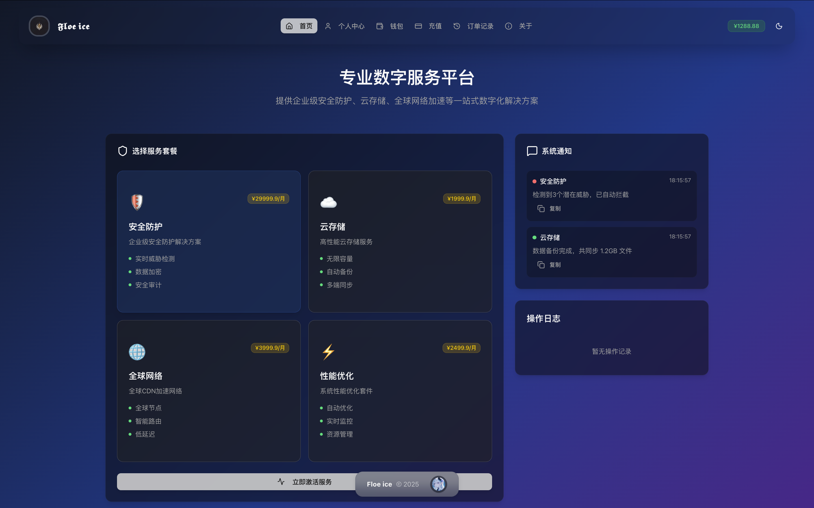</td>
    <td>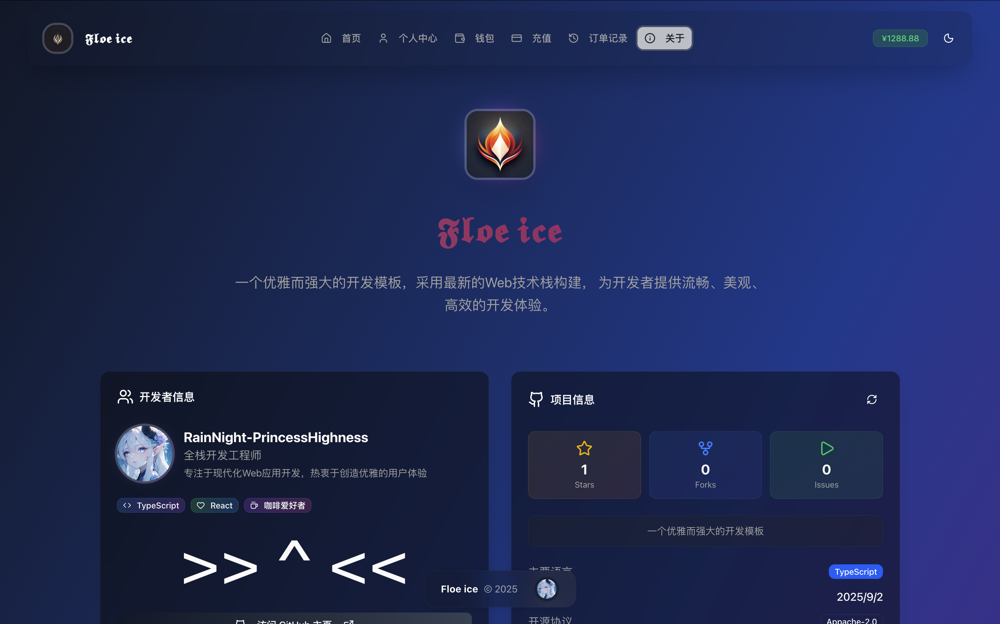</td>
    <td>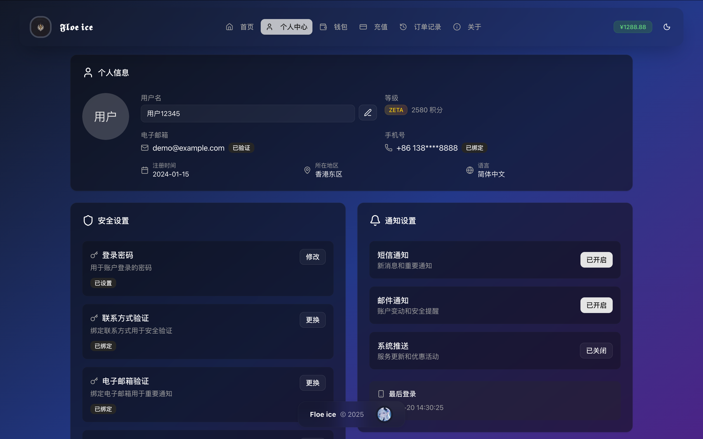</td>
  </tr>
  <tr>
    <td align="center"><strong>主页</strong></td>
    <td align="center"><strong>关于页面</strong></td>
    <td align="center"><strong>个人中心</strong></td>
  </tr>
</table>

<table>
  <tr>
    <td>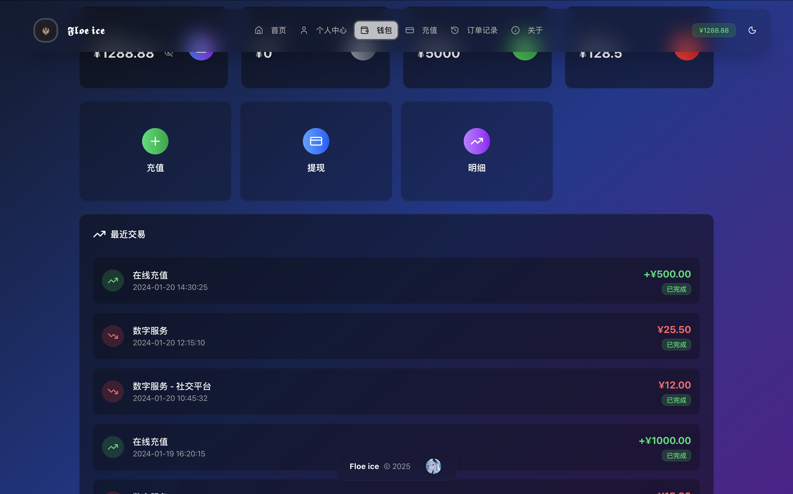</td>
    <td>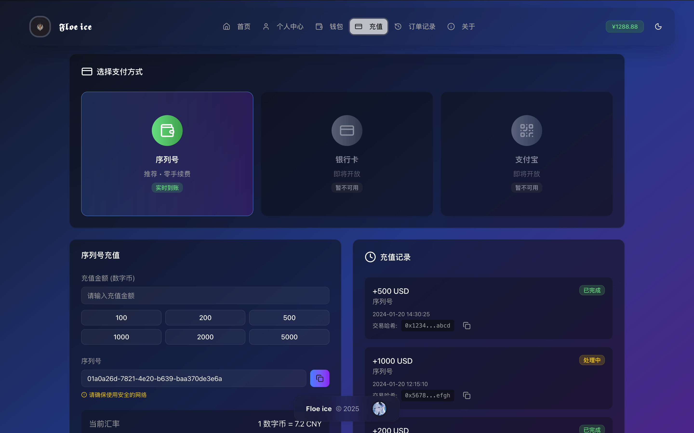</td>
    <td>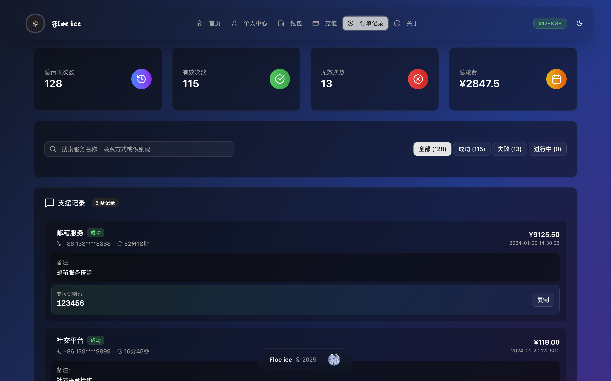</td>
  </tr>
  <tr>
    <td align="center"><strong>钱包系统</strong></td>
    <td align="center"><strong>充值中心</strong></td>
    <td align="center"><strong>历史记录</strong></td>
  </tr>
</table>

### ☀️ 浅色主题 Light Theme
<table>
  <tr>
    <td>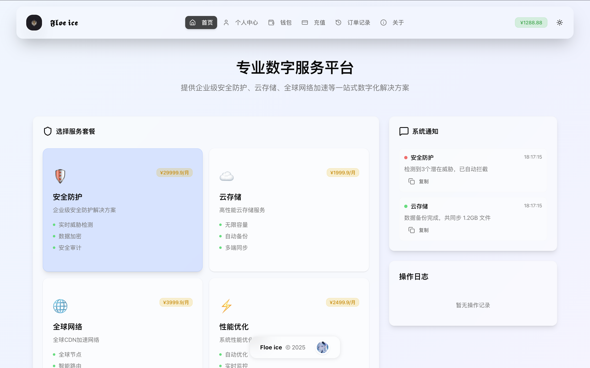</td>
    <td>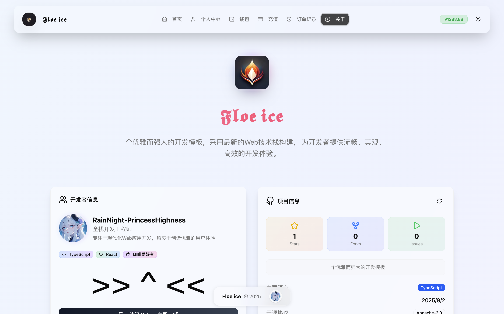</td>
    <td>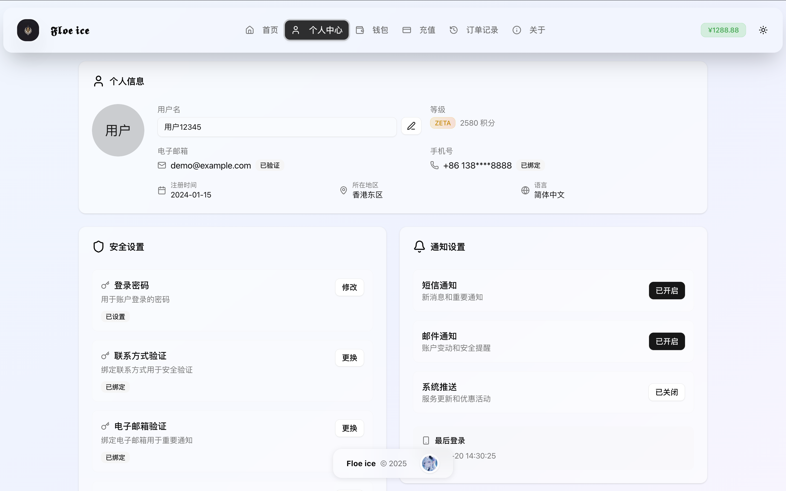</td>
  </tr>
  <tr>
    <td align="center"><strong>主页</strong></td>
    <td align="center"><strong>关于页面</strong></td>
    <td align="center"><strong>个人中心</strong></td>
  </tr>
</table>

<table>
  <tr>
    <td>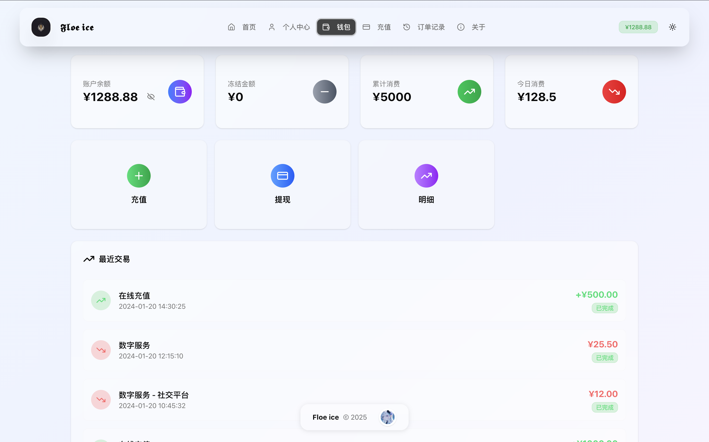</td>
    <td>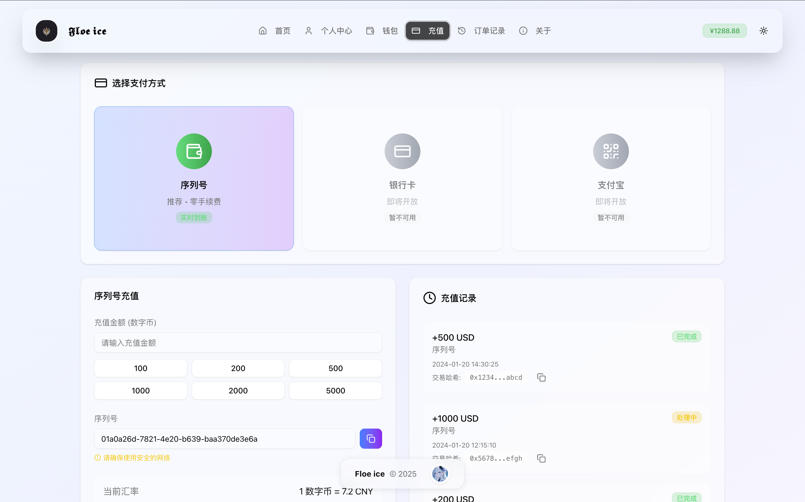</td>
    <td>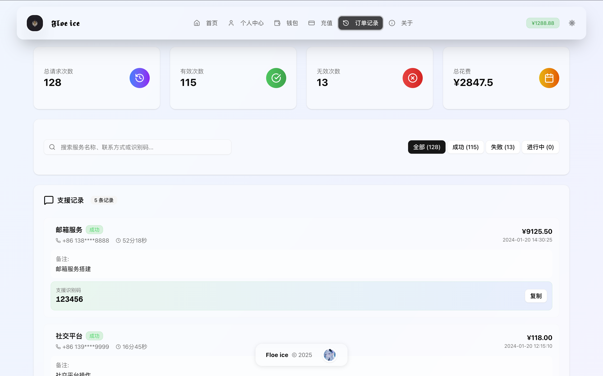</td>
  </tr>
  <tr>
    <td align="center"><strong>钱包系统</strong></td>
    <td align="center"><strong>充值中心</strong></td>
    <td align="center"><strong>历史记录</strong></td>
  </tr>
</table>

</div>

### 🎨 设计哲学

> "简约而不简单，优雅且富有内涵"

- **极致美学**: 毛玻璃效果与渐变光影的完美融合
- **流畅体验**: 丝滑的动画过渡，自然的交互反馈  
- **现代化**: 拥抱最新技术，追求卓越性能
- **可扩展**: 模块化设计，轻松适配各种业务场景

## 🌟 核心特性

### 🎭 视觉盛宴
- **🌈 渐变魔法**: 多层次色彩渐变营造梦幻氛围
- **🪟 毛玻璃美学**: Backdrop-blur 打造层次丰富的视觉效果
- **💫 动态光影**: 智能光晕和阴影系统
- **📱 响应式完美**: 从手机到 8K 显示器的完美适配

### ⚡ 技术之美
- **🚀 极速性能**: 基于 Next.js 15 和 Turbopack 的闪电般体验
- **🔒 类型安全**: 完整的 TypeScript 覆盖，消除运行时错误
- **🎪 动画系统**: Framer Motion 驱动的专业级动画框架
- **🎨 组件生态**: 基于 Shadcn UI 的现代化组件库

### 🧩 功能模块
- **🏠 优雅主页**: 展示核心功能的精美界面
- **👤 个人中心**: 完整的用户管理系统
- **💰 钱包系统**: 美观的财务管理界面
- **💳 充值中心**: 流畅的支付体验
- **📊 数据看板**: 清晰的历史记录展示
- **ℹ️ 关于页面**: 精美的项目介绍页面

### 🌙 主题系统
- **🌞 浅色主题**: 清新明亮，如春日暖阳
- **🌚 深色主题**: 优雅神秘，似夜空深邃
- **⚙️ 系统跟随**: 智能适配用户偏好

## 🛠️ 技术栈

<div align="center">

| 核心技术 | 版本 | 描述 |
|---------|------|------|
| **Next.js** | `15.5.2` | 🚀 全栈 React 框架 |
| **React** | `18+` | ⚛️ 用户界面库 |
| **TypeScript** | `5.0+` | 🔷 类型安全的 JavaScript |
| **Tailwind CSS** | `3.4+` | 🎨 原子化 CSS 框架 |
| **Framer Motion** | `Latest` | 🌀 专业动画库 |
| **Lucide Icons** | `Latest` | 🎯 精美图标集 |
| **Shadcn UI** | `Latest` | 🧩 现代组件库 |

</div>

## 🚀 快速开始

### 📋 环境要求
- **Node.js**: >= 18.0.0
- **npm**: >= 9.0.0 或 **pnpm**: >= 8.0.0

### 🔽 安装部署

```bash
# 克隆项目
git clone https://github.com/RainNight-PrincessHighness/floe-ice.git

# 进入目录
cd floe-ice

# 安装依赖
npm install
# 或使用 pnpm (推荐)
pnpm install

# 启动开发服务器
npm run dev
# 或
pnpm dev
```

### 🌐 访问应用
打开浏览器访问 [在线Demo](https://floeice.luminous.asia/)

享受这场视觉与技术的盛宴吧！ 🎉

## � 项目架构

```
floe-ice/
├── 🎨 src/
│   ├── 📱 app/                    # App Router 应用目录
│   │   ├── 🌐 api/               # API 路由
│   │   ├── 🎭 globals.css        # 全局样式
│   │   ├── 🏗️ layout.tsx         # 根布局
│   │   └── 🏠 page.tsx           # 主页面
│   ├── 🧩 components/            # 组件目录
│   │   ├── 📄 pages/             # 页面组件
│   │   │   ├── 👤 profile-page.tsx
│   │   │   ├── 💰 wallet-page.tsx
│   │   │   ├── 💳 recharge-page.tsx
│   │   │   ├── 📊 history-page.tsx
│   │   │   └── ℹ️ about-page.tsx
│   │   ├── 🎨 ui/                # UI 组件
│   │   │   ├── 🧭 top-nav.tsx
│   │   │   ├── 🎪 animated-background.tsx
│   │   │   └── 📝 [其他组件]
│   │   └── 🌙 theme-provider.tsx  # 主题提供者
│   └── 🔧 lib/
│       └── ⚙️ utils.ts           # 工具函数
├── 🌍 public/                    # 静态资源
├── 📦 package.json
├── ⚙️ next.config.ts             # Next.js 配置
├── 🎨 tailwind.config.ts         # Tailwind 配置
└── 📖 README.md
```

## 🎯 设计理念

### 🎨 美学原则
- **极简主义**: 去除冗余，突出核心
- **层次感**: 通过色彩、阴影、透明度构建视觉层次
- **一致性**: 统一的设计语言和交互模式
- **可达性**: 友好的无障碍设计

### 💡 技术理念
- **性能优先**: 每一行代码都为性能而生
- **类型安全**: TypeScript 保障代码质量
- **组件化**: 可复用的模块化设计
- **响应式**: 适配所有设备尺寸

### 🚀 用户体验
- **直觉操作**: 符合用户心理模型的交互设计
- **即时反馈**: 每个操作都有清晰的视觉反馈
- **流畅动画**: 自然的过渡效果增强沉浸感
- **个性化**: 支持主题切换和偏好设置

## 🔧 定制指南

### 🎨 主题定制
```typescript
// 在 tailwind.config.ts 中定制颜色
export default {
  theme: {
    extend: {
      colors: {
        primary: {
          50: '#your-color-50',
          // ... 其他色阶
        }
      }
    }
  }
}
```

### 🧩 组件扩展
```typescript
// 在 src/components/ui/ 中添加新组件
export function YourComponent() {
  return (
    <motion.div
      initial={{ opacity: 0 }}
      animate={{ opacity: 1 }}
      className="backdrop-blur-xl bg-background/50"
    >
      {/* 你的内容 */}
    </motion.div>
  )
}
```

### 📱 页面添加
1. 在 `src/components/pages/` 创建新页面组件
2. 在 `src/components/ui/top-nav.tsx` 添加导航项
3. 在 `src/app/page.tsx` 添加路由逻辑

## 📦 部署方案

### 🚀 Vercel (推荐)
```bash
npm run build
npx vercel --prod
```

---

**注意**: 这是一个演示项目，实际使用时请确保遵守相关法律法规和服务条款。
